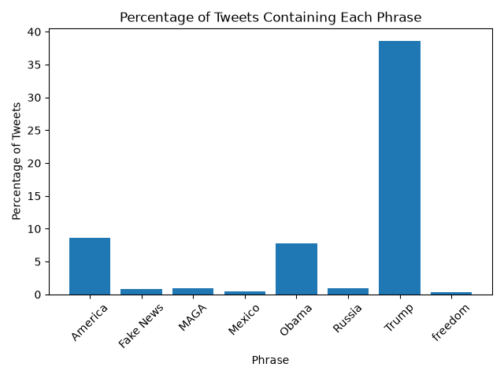

# [lab-web-data](https://csci40.rtealwitter.com/topics/05_web_scraping/lab.html)

## Tweet Analysis

The following table shows the percentage of tweets containing each phrase from 2009 to 2018.

## Bar Chart

The bar chart shows the percentage of tweets containing each of the eight selected phrases. "Trump" appeared most frequently, occurring in 38.58% of tweets, followed by "America" at 8.58% and "Obama" at 7.73%. This aligned with my initial prediction that 'Trump' and 'Obama' would be among the most frequent.